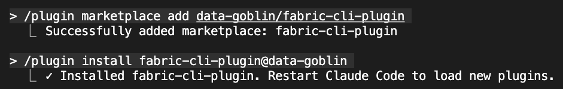
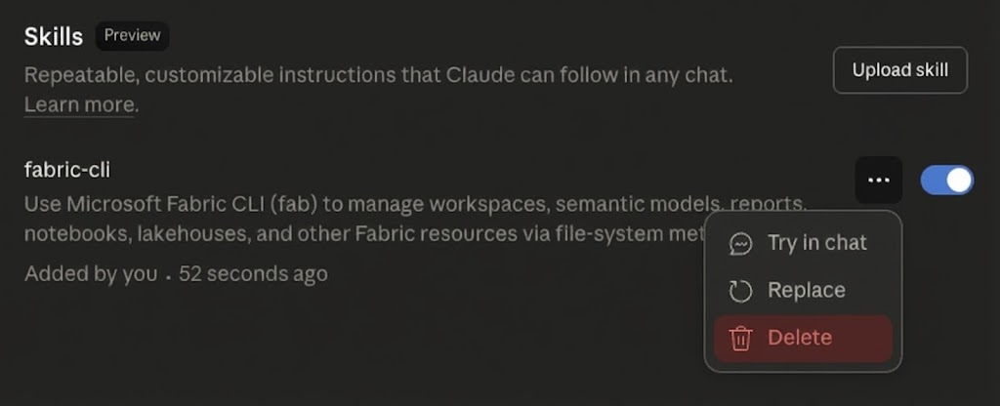

<h1 align="center">fabric-cli-plugin</h1>

<p align="center">
  Skill and MCP server for Microsoft Fabric CLI
</p>

<p align="center">
  
  
  
  
</p>

---

## Claude Code

```bash
# 1. Add marketplace source
/plugin marketplace add data-goblin/fabric-cli-plugin

# 2. Install the plugin
/plugin install fabric-cli-plugin@data-goblin
```



Or: `/plugin` > Browse Plugins > Select marketplace

<!-- BEGIN CLAUDE_DESKTOP -->
## Claude Desktop

### MCP Servers

> [!WARNING]
> Agents with a `Bash` tool like Claude Code don't need MCP servers.
> MCP servers allow agents to execute operations that may modify your Fabric environment.
> Use with caution.

| Server | Description |
|--------|-------------|
| [`fabric-cli-mcp.mcpb`](claude-desktop/fabric-cli-mcp.mcpb) | 17 tools for Fabric workspace and item operations |
| [`powerbi-modeling-mcp.mcpb`](claude-desktop/powerbi-modeling-mcp.mcpb) | Semantic model operations (Windows only) - repackaged from [Microsoft](https://github.com/microsoft/powerbi-modeling-mcp) |

**Install:** Download .mcpb > double-click > review > **Install**

### Skill (Fabric CLI context)

1. Download [`fabric-cli-skill.zip`](claude-desktop/fabric-cli-skill.zip)
2. Open Claude Desktop > **Settings** > **Capabilities** > **Skills** > *Upload skill*
3. Click **Upload skill** > select the ZIP
4. *(To remove)* (Reopen) Settings > Skills > fabric-cli (...) > Delete

<a href="docs/remove-fabric-cli-skill.png"></a>

Requires: Pro, Max, Team, or Enterprise plan

[Extensions Docs](https://docs.anthropic.com/en/docs/claude-desktop/extensions) | [Skills Docs](https://support.claude.com/en/articles/12512198-how-to-create-custom-skills)
<!-- END CLAUDE_DESKTOP -->

## Requirements

- [uv](https://docs.astral.sh/uv/) for MCP server
  - macOS: `brew install uv`
  - Windows: `winget install astral-sh.uv`
- [fab CLI](https://pypi.org/project/fabric-cli/) authenticated via `fab auth login`
- Windows: may need `PYTHONIOENCODING=utf-8` with some fab commands

## Testing

- **macOS** (15.6.1): Claude Code 2.0.55, Claude Desktop 1.0.1217 - 2025-11-27
- **Windows** (11 25H2): Claude Code 2.0.55, Claude Desktop 1.0.1217 - 2025-11-27

## What's Included

- **Skill**: Fab CLI guidance and patterns
- **Fabric CLI MCP**: 17 tools for Fabric operations (Claude Desktop only)
- **Power BI Modeling MCP**: Semantic model operations (Claude Desktop only)
- **Microsoft Docs MCP**: Auto-included (Claude Code only)

<br>

---

<p align="center">
  <em>All code and context are shared without any warranty or guarantees for any fellow</em><em>using Microsoft Fabric.</em>
</p>

<p align="center">
  <em>Built with assistance from <a href="https://claude.ai/claude-code">Claude Code</a> donkeys. AI-generated code has been reviewed but may contain errors. Use at your own risk.</p>

<p align="center">
  Context files are human-written and revised by Claude Code after iterative use. No AI-generated creative assets used.</em>
</p>

---

<p align="center">
  <a href="https://github.com/data-goblin">Kurt Buhler</a> · <a href="https://data-goblins.com">Data Goblins</a> · part of <a href="https://tabulareditor.com">Tabular Editor</a>
</p>
